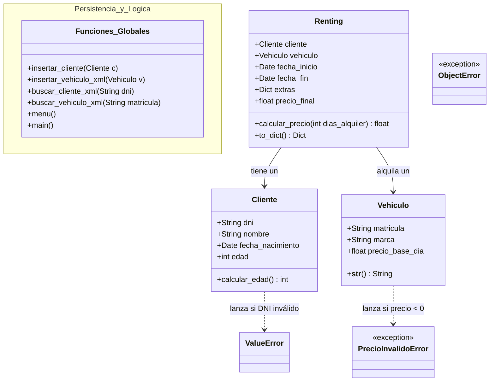

# Programa gestor de concesionario.

## PROPÓSITO

El propósito principal del programa es organizar y gestionar los alquileres **de coches** de un concesionario, gestionados con ficheros **XML** para almacenar los datos de manera local y poder acceder de manera sencilla desde el programa principal a los datos.

---

## REQUISITOS

- PyCharm 3.13 para la programación en Python

- VSCode para la gestión de JSON y XML con las extensiones: 
  1. XML,
  2. XML Tools
  3. JSON Tools

---

## INSTALACIÓN
Para la instalación del programa debemos seguir los siguientes pasos:

1. Clonar repositorio desde GitHub en la carpeta seleccionada.
   > Es importante que en esa carpeta se encuentren únicamente los elementos que componen el repositorio, en caso contrario podría originar errores en la ejecución o corrupción de datos.
2. Ejecutar concesionario.py

---

## ITEMS
- JSON:

### GESTIÓN DE ALQUILER
| **DATO** | **DESCRIPCIÓN** |
| :----------: | :----------: |
| **DNI** | Identificador del coche  |
| **MATRÍCULA** | Identificador del cliente |
| **EXTRAS** | Extras y valor de estos |
| **FECHA_INICIO** | Fecha de inicio del alquiler |
| **FECHA_FIN** | Fecha de finalización del alquiler |
| **PRECIO_FINAL** | Precio final al cliente |

- XML:

### GESTIÓN DE CLIENTES
| **DATO** | **DESCRIPCIÓN** |
| :----------: | :----------: |
| **DNI** | Documento de identidad, se usa cómo identificador del cliente |
| **NOMBRE_COMPLETO** | Nombre y Apellidos del cliente |
| **EDAD** | Edad del cliente |

### GESTIÓN DE COCHES
|**DATO** | **DESCRIPCIÓN** |
| :----------: | :----------: |
| **MATRÍCULA** | Identificador del vehículo |
| **MARCA** | Marca del coche |
| **PRECIO_POR_DÍA** | Precio de alquiler diario |

El uso de estos ficheros nos codifica y ordena la gestión de la base de datos. 
Para los datos de los **clientes** utilizamos *XML* para poder definir y manejar los datos de los clientes con mayor facilidad. 
Para los datos de los **alquileres** utilizamos *JSON* para definirlos cómo diccionarios y poder acceder a ellos de una manera simple y rápida.

---

<h1>Base de Datos</h1>
Las relaciones de las clases en la base de datos se organizan cómo podemos observar en el diagrama.

